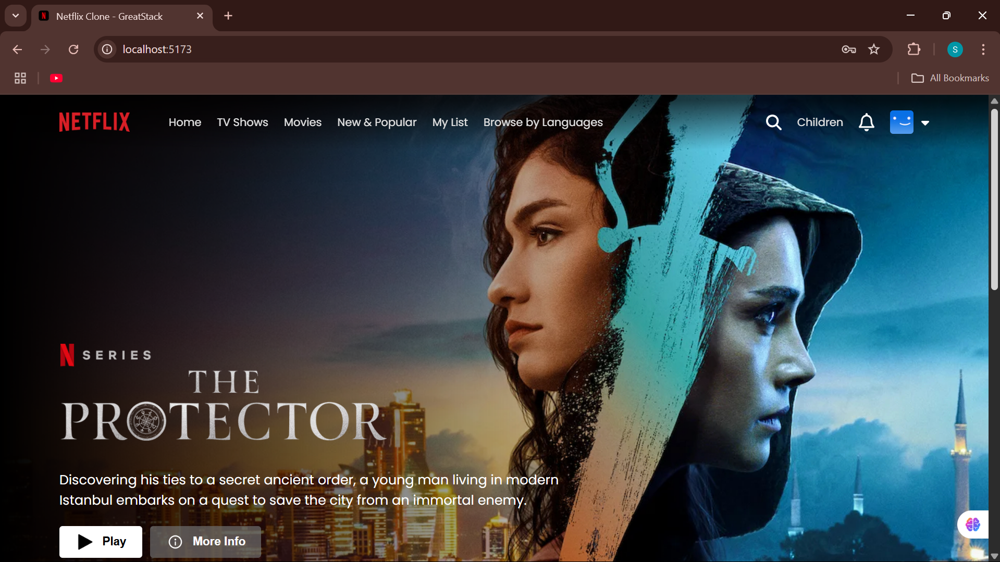
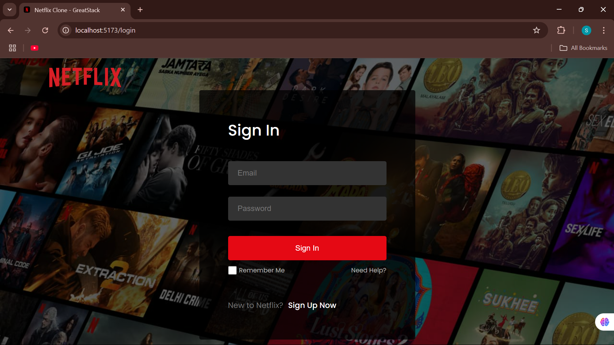

# 🎬 Netflix Clone

A responsive, feature-rich clone of the Netflix web app built using **React.js**, **Firebase**, and **TMDb API**. It allows users to browse movies, view trailers, and manage their account with Firebase authentication.

## 🔥 Features

- 🔐 **User Authentication** – Sign up, sign in, and sign out using Firebase Auth.
- 🎞️ **Movie Rows by Category** – Fetch and display movies using TMDb API.
- 🔍 **Search Functionality** – Search for movies by title.
- ▶️ **Trailer Playback** – Watch YouTube trailers via react-youtube.
- 📱 **Responsive Design** – Optimized for all screen sizes.

## 🛠️ Tech Stack

- **Frontend:** React.js, HTML5, CSS3
- **Authentication & Hosting:** Firebase
- **Movie Data:** [TMDb API](https://www.themoviedb.org/)
- **Trailer Playback:** react-youtube

## 📸 Screenshots

| Home Page | Login Page | 
|-----------|------------|
|  |  | 

## 🚀 Getting Started

### 1. Clone the repository

### 2. Install dependencies

 npm install

### 3. Add your Firebase & TMDb config

### 4. Run the development server

 npm start
